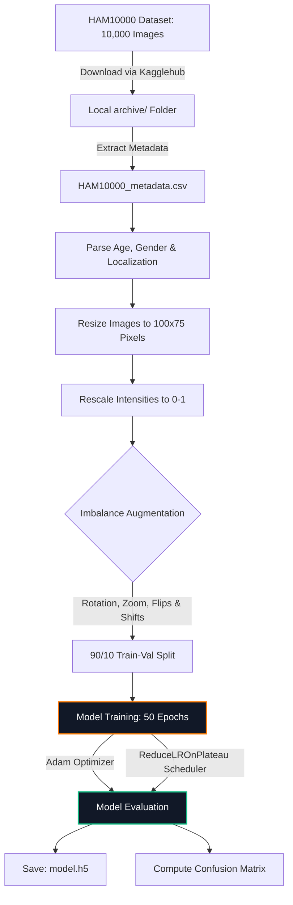
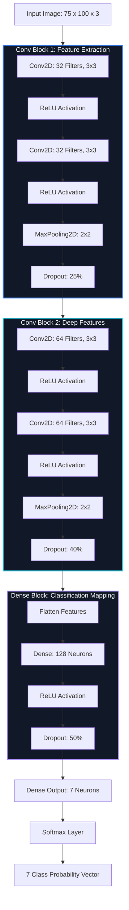

# 🔬 Skin Cancer Classification — CNN Deep Learning Approach

### **Multi-Class Dermoscopic Image Classification Pipeline utilizing TensorFlow/Keras & the HAM10000 Dataset**

[](https://python.org)
[](https://tensorflow.org)
[](https://keras.io)
[](https://kaggle.com)
[](LICENSE)

**An automated clinical diagnostic support tool classifying 7 distinct types of skin cancer lesions from dermoscopic images using custom convolutional layers, class imbalance augmentation, and adaptive learning rate scheduling.**

[Overview](#-about-the-project) • [Pipeline Architecture](#-data-processing-pipeline) • [CNN Model Design](#-cnn-model-architecture) • [Classes Description](#-skin-lesion-classes) • [Saved Artifacts](#-saved-artifacts) • [Quick Start](#-installation)

---

## 📖 About the Project

Melanoma and other skin carcinomas present severe public health concerns. Early, objective detection drastically improves prognosis. This project outlines the implementation of an end-to-end deep learning diagnostic pipeline built from scratch to categorize skin lesions into 7 classes using the benchmark **HAM10000** dataset.

The system handles severe class imbalances using real-time spatial transformations (augmentations) and maps final results onto a detailed confusion matrix.

---

## 🏗️ Data Processing Pipeline

The following flowchart maps the dataset's path from raw ingestion to the trained model:



---

## 🧠 CNN Model Architecture

The neural network is built with stacked convolutional blocks, pooling nodes, dropout regularization, and a dense multi-class classifier:



---

## 🩺 Skin Lesion Classes

The pipeline maps predictions to these seven diagnostic classes defined by the International Skin Imaging Collaboration (ISIC):

| Label Code | Disease / Lesion Class | Clinical Classification |
|------------|------------------------|-------------------------|
| **`akiec`** | Actinic keratoses & Intraepithelial Carcinoma | Pre-cancerous |
| **`bcc`** | Basal cell carcinoma | Cancerous (Malignant) |
| **`bkl`** | Benign keratosis-like lesions | Benign |
| **`df`** | Dermatofibroma | Benign |
| **`mel`** | Melanoma | Cancerous (Highly Malignant) |
| **`nv`** | Melanocytic nevi (Common Moles) | Benign |
| **`vasc`** | Vascular lesions | Benign |

---

## 🛠️ Hyperparameter Specifications

| Parameter | Value | Details |
|-----------|-------|---------|
| **Optimizer** | Adam | Initial Learning Rate = $0.001$ |
| **Loss Function** | Categorical Crossentropy | Categorical target arrays |
| **Epochs** | 50 | Early stopping patience = 5 |
| **Batch Size** | 10 | Mini-batch gradient descent |
| **Learning Rate Scheduler** | ReduceLROnPlateau | Reduces LR by $0.3\times$ if validation loss stalls for 2 epochs |

---

## 📦 Saved Artifacts

```
skin-cancer-classification/
├── skin-cancer-classification-cnn-approach.ipynb   # Diagnostic Pipeline Notebook
├── requirements.txt                                 # Core Dependencies
├── model.h5                                         # Trained weights (HDF5 format)
├── model_plot.png                                   # Plot of Keras Model Architecture
└── README.md
```

---

## ⚙️ Installation & Usage

### 1. Clone & Environment Set Up
```bash
git clone https://github.com/rajmodi262/SKIN_DISEASE_CLASSIFICATION.git
cd SKIN_DISEASE_CLASSIFICATION
python -m venv venv
source venv/bin/activate  # Windows: venv\Scripts\activate
pip install -r requirements.txt
```
*(If `requirements.txt` is missing, run: `pip install tensorflow keras numpy pandas matplotlib seaborn scikit-learn pillow jupyter`)*

### 2. Download HAM10000 Dataset
Download from [Kaggle HAM10000](https://www.kaggle.com/datasets/kmader/skin-cancer-mnist-ham10000) and place the folders inside an `archive/` directory in the project root:
```
SKIN_DISEASE_CLASSIFICATION/
├── archive/
│   ├── HAM10000_metadata.csv
│   ├── HAM10000_images_part_1/
│   └── HAM10000_images_part_2/
```

### 3. Run the Pipeline
```bash
jupyter notebook skin-cancer-classification-cnn-approach.ipynb
```
Select "Run All Cells" to trigger preprocessing, augmentation, network training, and model evaluation.
